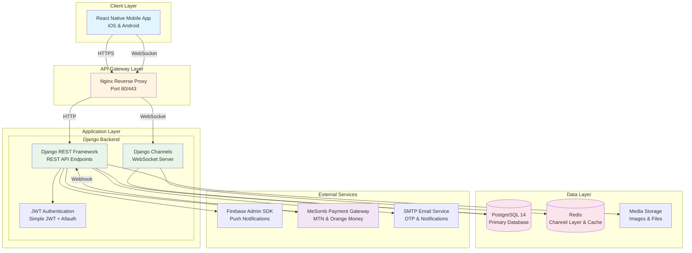
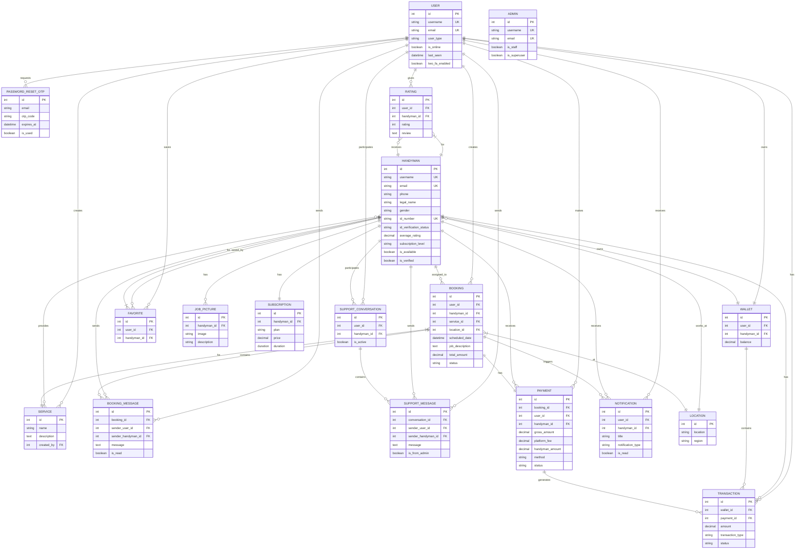
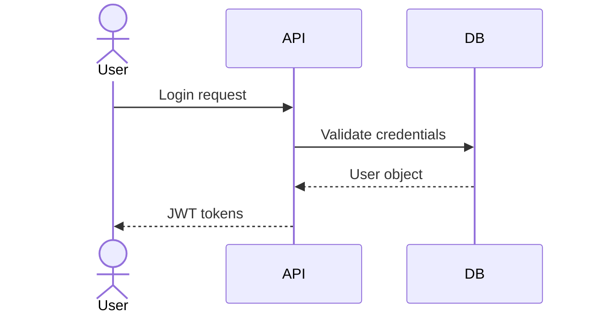

# HandymanRN — Architecture Diagrams & Tools Guide

## Table of Contents
1. [GitHub Repositories Reference](#1-github-repositories-reference)
2. [High-Level Architecture Diagram](#2-high-level-architecture-diagram)
3. [Entity Relationship Diagram (ERD)](#3-entity-relationship-diagram-erd)
4. [Tools for Manual Diagram Creation](#4-tools-for-manual-diagram-creation)

---

## 1. GitHub Repositories Reference

### Project Repository
**HandymanRN Main Repository**
- **URL:** https://github.com/ArnoldCtn/HandymanRN
- **Purpose:** Complete platform codebase including backend (Django), mobile app (React Native), and documentation

---

### Backend Technologies

| Technology | GitHub Repository | Version Used | Purpose |
|------------|-------------------|--------------|---------|
| **Django** | https://github.com/django/django | 5.0 | Backend web framework |
| **Django REST Framework** | https://github.com/encode/django-rest-framework | 3.14 | REST API toolkit |
| **Django Channels** | https://github.com/django/channels | 4.0 | WebSocket support |
| **Simple JWT** | https://github.com/jazzband/djangorestframework-simplejwt | 5.3 | JWT authentication |
| **django-allauth** | https://github.com/pennersr/django-allauth | 0.57 | Authentication & registration |
| **django-axes** | https://github.com/jazzband/django-axes | 7.0 | Brute force protection |
| **python-dotenv** | https://github.com/theskumar/python-dotenv | 1.0 | Environment configuration |
| **MeSomb SDK** | https://github.com/BeeCorpSarl/mesomb-python | Latest | Payment gateway (Cameroon) |
| **Daphne** | https://github.com/django/daphne | 4.1 | ASGI server |
| **PostgreSQL** | https://github.com/postgres/postgres | 14 | Primary database |
| **Redis** | https://github.com/redis/redis | 7.2 | Channel layer & caching |

---

### Frontend Technologies

| Technology | GitHub Repository | Version Used | Purpose |
|------------|-------------------|--------------|---------|
| **React Native** | https://github.com/facebook/react-native | 0.72 | Mobile app framework |
| **Expo** | https://github.com/expo/expo | SDK 49 | React Native toolchain |
| **Expo Router** | https://github.com/expo/router | Latest | File-based navigation |
| **TypeScript** | https://github.com/microsoft/TypeScript | 5.0 | Type-safe JavaScript |
| **Axios** | https://github.com/axios/axios | 1.6 | HTTP client |
| **AsyncStorage** | https://github.com/react-native-async-storage/async-storage | 1.18 | Local data persistence |
| **React Native Maps** | https://github.com/react-native-maps/react-native-maps | 0.31 | Map visualization |
| **Socket.io-client** | https://github.com/socketio/socket.io-client | 4.6 | Real-time communication |
| **React i18next** | https://github.com/i18next/react-i18next | 13.0 | Internationalization |

---

### Infrastructure & DevOps

| Technology | GitHub Repository | Version Used | Purpose |
|------------|-------------------|--------------|---------|
| **Nginx** | https://github.com/nginx/nginx | 1.24 | Web server & reverse proxy |
| **Gunicorn** | https://github.com/benoitc/gunicorn | 21.2 | WSGI server |
| **Docker** | https://github.com/docker/docker | Latest | Containerization |
| **Docker Compose** | https://github.com/docker/compose | Latest | Multi-container orchestration |
| **Git** | https://github.com/git/git | 2.40 | Version control |

---

### Documentation & Diagramming Tools

| Tool | GitHub Repository | Purpose |
|------|-------------------|---------|
| **Mermaid** | https://github.com/mermaid-js/mermaid | Text-based diagram generation |
| **draw.io** | https://github.com/jgraph/drawio-diagrams | Visual diagramming tool |
| **dbdiagram.io** | https://github.com/ondb/diagrams | Database schema diagrams |
| **PlantUML** | https://github.com/plantuml/plantuml | UML diagram generation |

---

## 2. High-Level Architecture Diagram



**Architecture Layers:**
1. **Client Layer:** React Native mobile app (iOS/Android)
2. **API Gateway:** Nginx handles load balancing, SSL termination, and routing
3. **Application Layer:** Django REST Framework (HTTP) + Django Channels (WebSocket)
4. **Data Layer:** PostgreSQL (persistent data), Redis (caching & channels), Media storage
5. **External Services:** Firebase (notifications), MeSomb (payments), Email (SMTP)

---

## 3. Entity Relationship Diagram (ERD)



**ERD Legend:**
- `||` = one (1)
- `o{` = many (*)
- `}|` = one or zero (0..1)
- `PK` = Primary Key
- `FK` = Foreign Key
- `UK` = Unique Key

---

## 4. Tools for Manual Diagram Creation

### Recommended Tools by Diagram Type

#### **For Class Diagrams & Use Case Diagrams**

**Tool: draw.io (diagrams.net)** ⭐ *Best Overall*

**Why:**
- 100% free, no account required
- Web-based + desktop app + VS Code extension
- Extensive UML shape libraries
- Drag-and-drop interface
- Exports to PNG, SVG, PDF, and more
- No learning curve

**How to Use:**
1. **Option A - VS Code Extension:**
   - Install "Draw.io Integration" extension in VS Code
   - Create new file: `diagrams.drawio`
   - Use UML shapes from left panel

2. **Option B - Web Version:**
   - Go to https://app.diagrams.net
   - Create new diagram
   - Select "UML" shape library
   - Drag & drop classes/use cases
   - Connect with straight lines (use orthogonal connectors)

3. **Steps for Class Diagram:**
   - Add rectangles for each class
   - Write attributes inside (e.g., `+username: String`)
   - Use straight lines with arrowheads for relationships
   - Label with cardinality (1, *, 0..1, etc.)
   - Export as PNG/SVG

**GitHub:** https://github.com/jgraph/drawio-diagrams

---

#### **For Sequence Diagrams**

**Tool: Mermaid.js** ⭐ *Easiest for Developers*

**Why:**
- Text-based (write code, not drag-and-drop)
- Version control friendly
- Renders automatically on GitHub
- Simple syntax
- Instant preview at https://mermaid.live/

**How to Use:**
1. Write Mermaid code (see examples below)
2. Paste into https://mermaid.live/ for live preview
3. Export as SVG or PNG
4. Or use VS Code extension "Markdown Preview Mermaid Support"

**Example Syntax:**


**Alternative: PlantUML**
- More features than Mermaid
- Similar text-based approach
- Desktop app available
- GitHub: https://github.com/plantuml/plantuml

---

#### **For ERD (Entity Relationship Diagrams)**

**Tool: dbdiagram.io** ⭐ *Best for Database Schemas*

**Why:**
- Specifically designed for ERDs
- Simple DSL (Domain Specific Language)
- Auto-layout (no manual positioning needed)
- Exports to PNG, SVG, PDF
- Can import from SQL

**How to Use:**
1. Go to https://dbdiagram.io
2. Create new diagram
3. Write schema in simple text format:

```dbml
User {
  int id PK
  string username UK
  string email UK
  datetime created_at
}

Booking {
  int id PK
  int user_id FK
  int handyman_id FK
  decimal total_amount
  string status
}

User ||--o{ Booking : creates
```

4. Diagram renders automatically
5. Export as PNG/SVG

**Alternative: draw.io**
- Use "ERD" shape library
- More manual control
- Better for custom styling

**GitHub:** https://github.com/ondb/diagrams

---

#### **For High-Level Architecture Diagrams**

**Tool: draw.io (diagrams.net)** ⭐ *Most Flexible*

**Why:**
- Can use generic shapes or cloud icons
- Good for deployment architecture
- Professional appearance
- Easy to export high-resolution images

**How to Use:**
1. Open draw.io
2. Use "AWS" or "Azure" shape libraries for cloud icons
3. Or use basic rectangles and arrows
4. Group related components with containers
5. Use different colors for layers (client, server, database, external)

**Alternative: Lucidchart**
- More professional templates
- Collaborative (team editing)
- Paid but has free tier
- https://lucidchart.com

---

### Quick Reference: Which Tool for Which Diagram?

| Diagram Type | Primary Tool | Alternative | Why |
|--------------|--------------|-------------|-----|
| **Class Diagram** | draw.io | PlantUML | Visual, easy to use |
| **Use Case Diagram** | draw.io | Mermaid | Drag & drop actors/use cases |
| **Sequence Diagram** | Mermaid.js | PlantUML | Text-based, GitHub-compatible |
| **ERD** | dbdiagram.io | draw.io | Database-focused, auto-layout |
| **Architecture Diagram** | draw.io | Lucidchart | Professional, flexible |
| **Deployment Diagram** | draw.io | AWS Architecture Icons | Cloud icons available |

---

### Pro Tips for Your Thesis

1. **Consistency:** Use the same tool for all diagrams of the same type
2. **Color Scheme:** Use consistent colors across all diagrams (e.g., blue for users, green for handymen, purple for payments)
3. **Resolution:** Export at 300 DPI minimum for print quality
4. **Format:** Use SVG for scalability, PNG for compatibility
5. **GitHub:** Use Mermaid for diagrams in Markdown files (auto-renders)
6. **Documentation:** Keep diagram source files (.drawio, .puml, .mmd) in your repo for future edits

---

### Installation Summary

**For VS Code (Recommended):**
```bash
# Install these extensions in VS Code:
1. "Draw.io Integration" (by hediet) - for draw.io diagrams
2. "Markdown Preview Mermaid Support" (by yzhang) - for Mermaid diagrams
```

**For Desktop Apps:**
```bash
# draw.io desktop (offline)
Download from: https://github.com/jgraph/drawio-desktop/releases

# PlantUML (requires Java)
Download from: https://plantuml.com/download
```

**For Web Tools (No Installation):**
- draw.io: https://app.diagrams.net
- Mermaid Live: https://mermaid.live
- dbdiagram.io: https://dbdiagram.io

---

## Summary

You now have:
1. ✅ Complete GitHub repository list for all technologies used
2. ✅ High-level architecture diagram (Mermaid format)
3. ✅ Complete ERD with all major entities and relationships
4. ✅ Detailed tool recommendations with step-by-step guides

**Next Steps:**
1. Copy the Mermaid diagrams into your documentation
2. Use draw.io to create polished versions for your thesis
3. Export high-resolution images for embedding in documents
4. Keep diagram source files in your GitHub repository