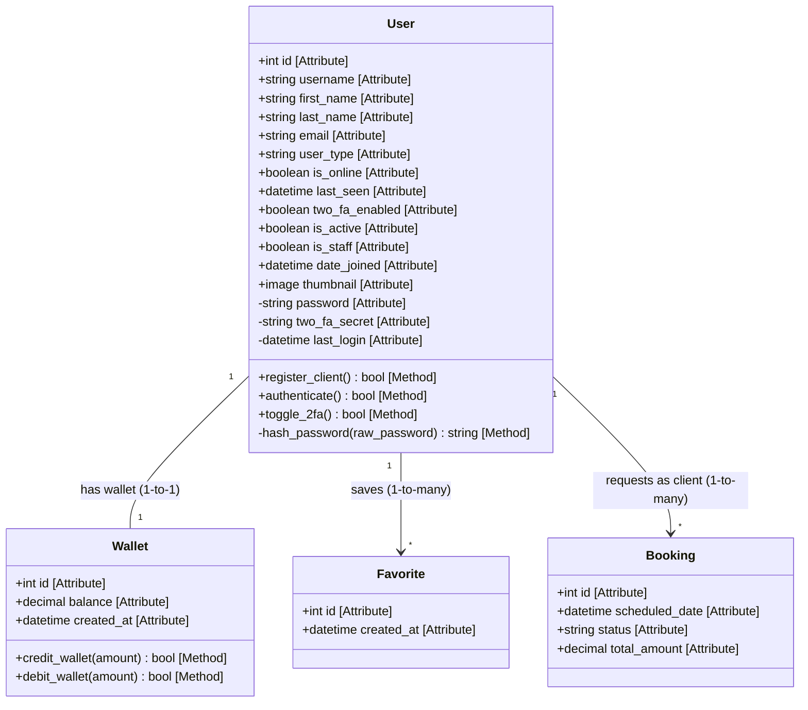
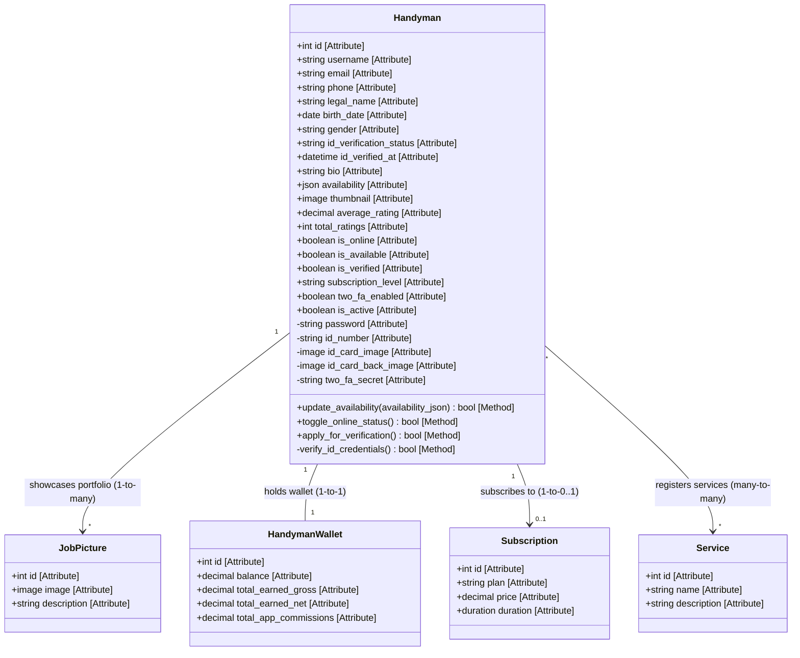
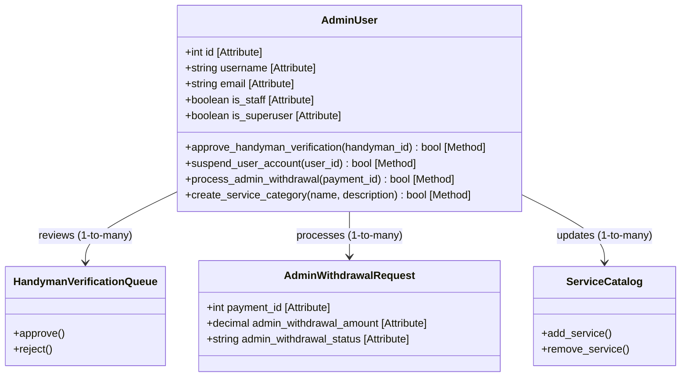
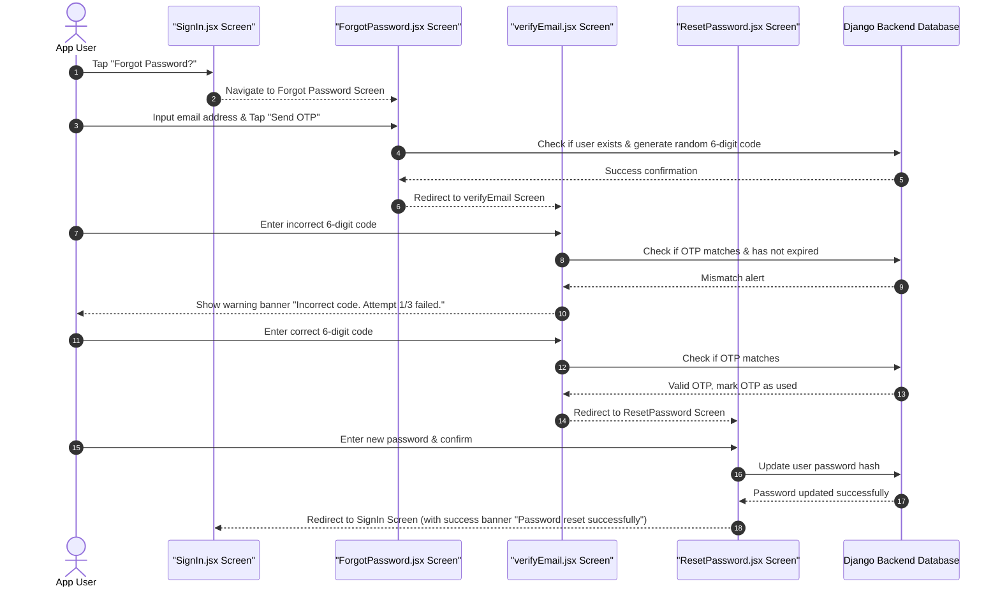
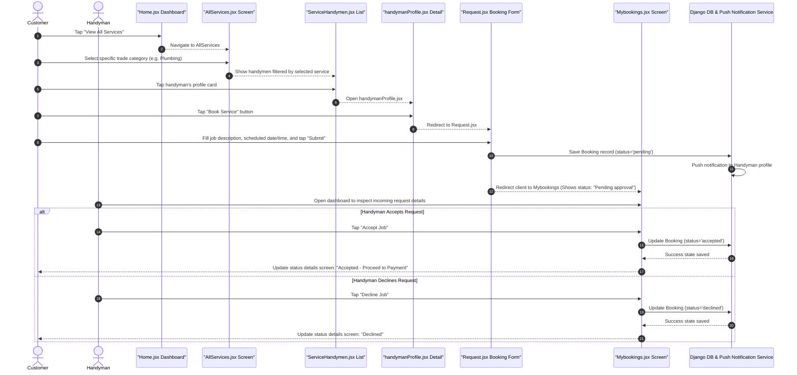

# HandymanRN: Comprehensive Diagrams & Architecture Specification

This document provides a comprehensive structural and behavioral specification for the HandymanRN project, strictly mapping to the database schemas defined in your Django models (`MODELS_REFERENCE.md`) and the React Native application screen structure (`mobile/app`).

---

## 1. Separate Class Diagrams

To fit the exact project models where `User` (Client) and `Handyman` are separate authentication tables and `Admin` runs on top of standard Django staff privileges, we separate these structures into three dedicated class diagrams.

### A. User (Client) Class Diagram
Represents the client-side user account (extends Django's `AbstractUser`) and its local relationships.



### B. Handyman Class Diagram
Represents a service provider account (extends Django's `AbstractBaseUser` + `PermissionsMixin`) and its specialized verification, subscription, and job relationships.



### C. Admin Class Diagram
Admins manage platform state, vet service providers, handle transaction requests, and configure directories. In the codebase, admins are standard `User` instances configured with `is_staff=True` and `is_superuser=True`.



---

## 2. Granular Attribute & Method Details

The table below breaks down the attributes and methods mapped to your actual project tables.

### User Class (Table: `users_user`)
* **Attributes**:
  * `+id` (Public, `AutoField`): System unique key.
  * `+username` (Public, `CharField`): User handle (must be unique).
  * `+first_name` (Public, `CharField`): User first name.
  * `+last_name` (Public, `CharField`): User last name.
  * `+email` (Public, `CharField`): Authentication email address.
  * `+user_type` (Public, `CharField`): Type flag (defaults to `'client'`).
  * `+is_online` (Public, `BooleanField`): Tracks real-time presence.
  * `+last_seen` (Public, `DateTimeField`): Last logged activity timestamp.
  * `+two_fa_enabled` (Public, `BooleanField`): Flag showing if 2-Factor Authentication is active.
  * `+is_active` (Public, `BooleanField`): Flag indicating account activity.
  * `+is_staff` (Public, `BooleanField`): Designates admin panel login permissions.
  * `+date_joined` (Public, `DateTimeField`): User registration timestamp.
  * `+thumbnail` (Public, `ImageField`): Profile image path.
  * `-password` (Private, `CharField`): Encrypted credentials.
  * `-two_fa_secret` (Private, `CharField`): Crypto seed for authenticator apps.
  * `-last_login` (Private, `DateTimeField`): Session logs.
* **Methods**:
  * `+register_client()` (Public, returns `bool`): Creates database entries.
  * `+authenticate()` (Public, returns `bool`): Handles password comparisons.
  * `+toggle_2fa()` (Public, returns `bool`): Updates 2FA status.
  * `-hash_password(raw_password)` (Private, returns `string`): Internal encryption algorithm.

### Handyman Class (Table: `handymen_handyman`)
* **Attributes**:
  * `+id` (Public, `AutoField`): Unique identifier.
  * `+username` (Public, `CharField`): Handle name.
  * `+email` (Public, `EmailField`): Communication and authentication email.
  * `+phone` (Public, `CharField`): Contact phone number.
  * `+legal_name` (Public, `CharField`): Official legal identification name.
  * `+birth_date` (Public, `DateField`): Vetting birth date.
  * `+gender` (Public, `CharField`): Gender selection.
  * `+id_verification_status` (Public, `CharField`): Identity status (`'pending'`, `'verified'`, `'failed'`).
  * `+id_verified_at` (Public, `DateTimeField`): Verification date.
  * `+bio` (Public, `TextField`): Portfolio description.
  * `+availability` (Public, `JSONField`): Calendar availability rules dictionary.
  * `+thumbnail` (Public, `ImageField`): Professional portrait path.
  * `+average_rating` (Public, `DecimalField`): Aggregated review rating.
  * `+total_ratings` (Public, `PositiveIntegerField`): Ratings count.
  * `+is_online` (Public, `BooleanField`): Active sockets toggle.
  * `+is_available` (Public, `BooleanField`): Toggles whether provider accepts job requests.
  * `+is_verified` (Public, `BooleanField`): Admin vetting approval flag.
  * `+subscription_level` (Public, `CharField`): Account levels (`'free'`, `'pro'`, `'premium'`).
  * `-password` (Private, `CharField`): Vetting/payout key hashes.
  * `-id_number` (Private, `CharField`): Government national identification number.
  * `-id_card_image` (Private, `ImageField`): Front scan of government ID.
  * `-id_card_back_image` (Private, `ImageField`): Back scan of government ID.
* **Methods**:
  * `+update_availability(availability_json)` (Public, returns `bool`): Modifies schedule JSON structure.
  * `+toggle_online_status()` (Public, returns `bool`): Updates real-time socket connections.
  * `+apply_for_verification()` (Public, returns `bool`): Uploads verification assets to admin queues.
  * `-verify_id_credentials()` (Private, returns `bool`): Checks matching government IDs.

---

## 3. Relationships Directory (Database Rules)

| Principal Source | Principal Target | Type | Multiplicity | Business Rule & Properties |
| :--- | :--- | :--- | :--- | :--- |
| `User` | `Booking` | ForeignKey | `1 -> *` | **Client Bookings**: `User` acts as client, referenced in booking via `related_name='bookings_as_user'`. |
| `Handyman` | `Booking` | ForeignKey | `1 -> *` | **Provider Bookings**: `Handyman` receives job assignments, referenced in booking via `related_name='bookings_as_handyman'`. |
| `Booking` | `Service` | ForeignKey | `* -> 1` | **Service Association**: Every booking references a specific type of trade category using a protected constraint (`PROTECT`). |
| `Booking` | `Payment` | ForeignKey | `1 -> 1` | **Invoice Link**: Associated with `related_name='payment'`. |
| `User` | `Wallet` | OneToOne | `1 -> 1` | **Client Balance**: Links the client's wallet with cascades on delete. |
| `Handyman` | `Wallet` | OneToOne | `1 -> 1` | **Handyman Ledger**: Dedicated handyman balance ledger tracking platform cuts and payouts. |
| `Handyman` | `JobPicture` | ForeignKey | `1 -> *` | **Portfolio Gallery**: Display pictures associated with the handyman profile (`related_name='job_pictures'`). |

---

## 4. Screen-Based Sequence Diagrams

These flows correspond directly to your React Native pages (`mobile/app`) and the MeSomb payment method integrations.

### A. Auth & Password Reset with OTP Flow
Uses screens: `SignIn.jsx`, `ForgotPassword.jsx`, `verifyEmail.jsx`, `ResetPassword.jsx`.



---

### B. Booking Flow Screen Transitions
Uses screens: `Home.jsx`, `AllServices.jsx`, `ServiceHandymen.jsx`, `handymanProfile.jsx`, `Request.jsx`, `Mybookings.jsx`.



---

### C. MeSomb Cameroon MTN / Orange Payment Flow
Uses MTN Mobile Money or Orange Money. Runs via MeSomb payment APIs. Matches screens: `booking-detail` screen, MTN/Orange prompt, and `wallet.jsx`.

```mermaid
sequenceDiagram
    autonumber
    actor Client as Customer
    actor Handy as Handyman
    participant Details as "booking-detail Screen"
    participant WalletScr as "wallet.jsx Screen"
    participant MeSomb as MeSomb Gateway (MTN / Orange Mobile Money)
    participant Carrier as Carrier Network (MTN / Orange)
    participant DB as Backend Database (payments_payment / wallet)

    Client->>Details: Select booking (Status: Accepted)
    Client->>Details: Select Mobile Money method ('mtn' or 'orange')
    Client->>Details: Enter phone number and tap "Pay Booking"
    
    Details->>DB: POST /payments/ (Create payment, status='pending')
    DB->>MeSomb: Request transaction collection (phone, gross_amount)
    MeSomb->>Carrier: Route collection request to phone number
    
    Carrier-->>Client: Display USSD popup authorization on mobile screen "Enter PIN to pay X CFA"
    Client->>Carrier: Enter payment PIN and authorize transaction
    
    Carrier-->>MeSomb: Payment Success notification
    MeSomb-->>DB: MeSomb Webhook call (status='SUCCESS', collect_ref='X')
    
    %% Split Payment logic implementation
    DB->>DB: Set payments_payment collect_status='collected'
    DB->>DB: Calculate Platform Fee (30%) & Handyman Payout (70%)
    DB->>DB: Credit Handyman Wallet balance
    DB->>DB: Credit Platform commission wallet balance
    DB->>DB: Set payments_payment status='split'
    DB->>DB: Update Booking status='paid'
    
    DB-->>Details: Notification status updated
    Details-->>Client: Show success banner "Payment Completed Successfully!"
    
    %% Handyman wallet visibility
    Handy->>WalletScr: Navigate to wallet.jsx
    WalletScr->>DB: Query Wallet table for Handyman ID
    DB-->>WalletScr: Return net balance & transactions list
    WalletScr-->>Handy: Show updated balance
```

---

## 5. Use Case Specifications & Diagrams

### Use Case Diagram

```mermaid
leftToRightDirection
flowchart TD
    %% Actors
    subgraph Users
        C[Client / User]
        H[Handyman]
        A[Admin / Staff]
    end

    %% Use Cases
    subgraph System Actions
        UC1(Request Password Reset OTP)
        UC2(Update Client/Handyman Profile)
        UC3(Request & Schedule Booking)
        UC4(Process Mobile Payment MTN/Orange)
        UC5(Update Service Catalog)
        UC6(Accept/Decline Job requests)
        UC7(Approve Handyman Profile Verification)
    end

    %% Client Interactions
    C --> UC1
    C --> UC2
    C --> UC3
    C --> UC4

    %% Handyman Interactions
    H --> UC1
    H --> UC2
    H --> UC6

    %% Admin Interactions
    A --> UC5
    A --> UC7
```

---

### Use Case Table Details

#### Use Case: Process Mobile Payment (MTN/Orange via MeSomb)
* **Use Case ID**: UC-04
* **Actors**: Customer (Client)
* **Description**: Allows clients to pay for bookings via Cameroon Mobile Money (MTN MoMo or Orange Money) through MeSomb integration.
* **Preconditions**: The customer is logged in, has an accepted booking, and has sufficient funds in their mobile money account.
* **Basic Flow**:
  1. The client opens the booking in `booking-detail` screen and selects MTN or Orange as the payment method.
  2. The client enters their mobile money account number and taps "Pay".
  3. The system generates a database entry in the `payments_payment` table with status `'pending'`.
  4. The backend sends a request to the MeSomb gateway, which triggers a push notification (USSD PIN prompt) on the client's phone.
  5. The client enters their mobile wallet PIN to authorize the transaction.
  6. The carrier processes the transaction and returns a success notification to MeSomb.
  7. MeSomb triggers a backend callback webhook confirming payment status.
  8. The backend updates the payment entry to `'collected'`, calculates the 30% platform fee and 70% handyman split, updates the respective wallets, and marks the booking as `'paid'`.
  9. The client is shown a success screen on the mobile app, and the handyman receives a notification.
* **Postconditions**: The booking status is set to `'paid'`, transaction records are saved, and the handyman's wallet balance increases.

#### Use Case: Approve Handyman Profile Verification
* **Use Case ID**: UC-07
* **Actors**: Admin (Staff/Superuser)
* **Description**: The administrator verifies the handyman's national identification card and details before listing them.
* **Preconditions**: A handyman has completed registration, uploaded their ID card images, and has a verification status of `'pending'`.
* **Basic Flow**:
  1. The administrator logs into the Django Admin dashboard.
  2. The admin navigates to the Handyman entries and filters profiles by `id_verification_status = 'pending'`.
  3. The admin clicks on a profile to view the uploaded government ID details and photo scans.
  4. The admin verifies the credentials against the system records.
  5. The admin changes `id_verification_status` to `'verified'` and toggles `is_verified` to `True`.
  6. The system saves the timestamp `id_verified_at` and automatically notifies the handyman.
* **Postconditions**: The handyman is marked as verified and can receive booking requests on the platform.
