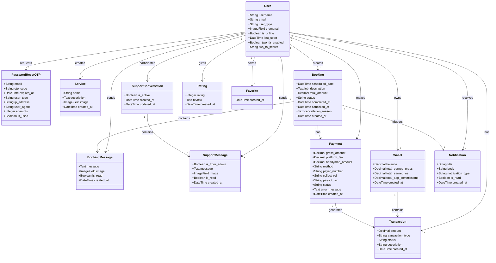
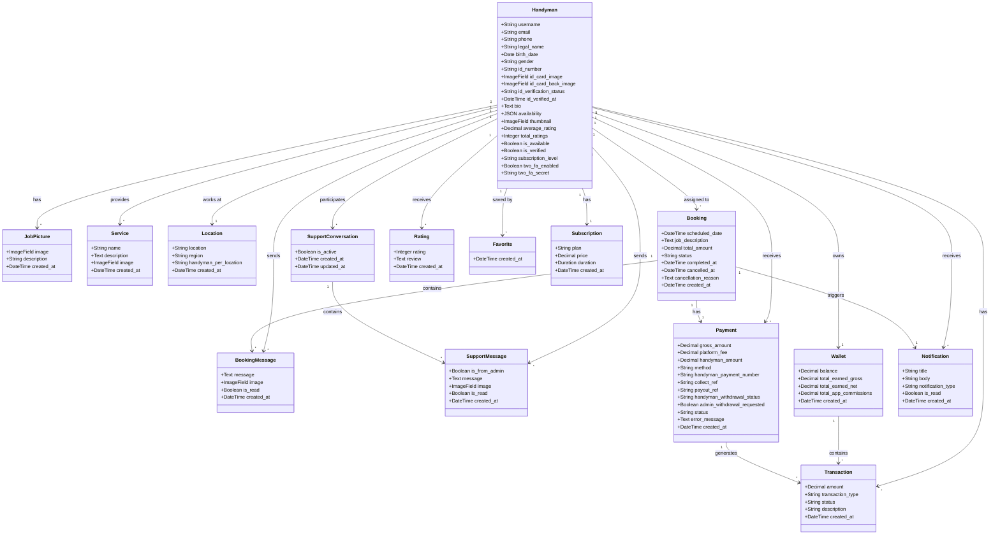
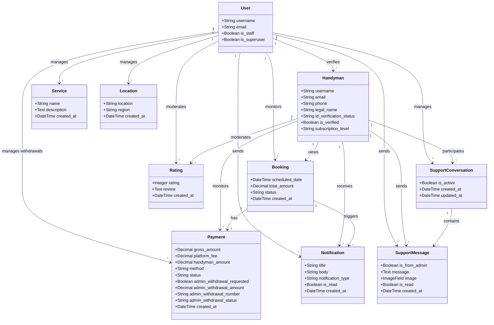
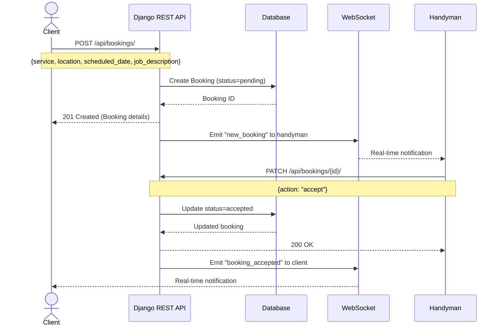
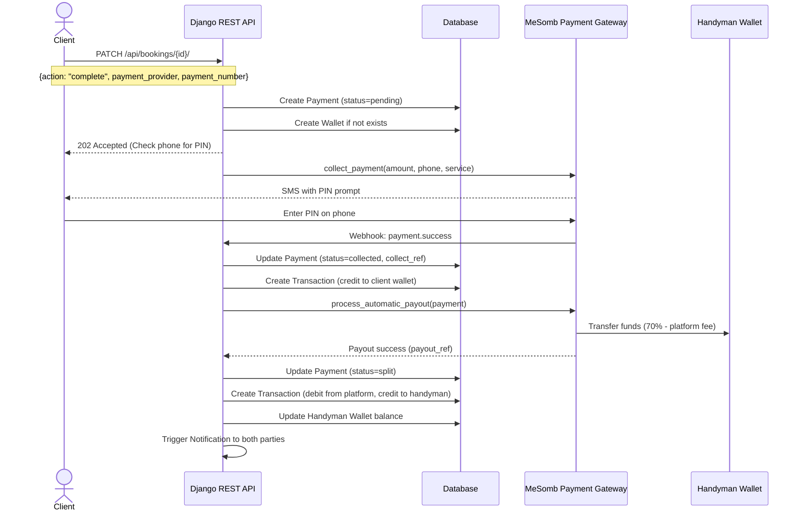
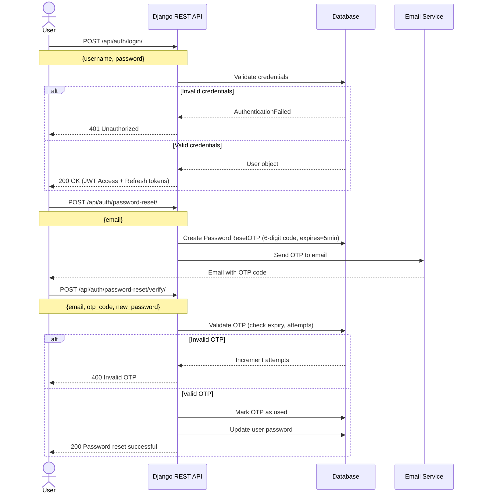
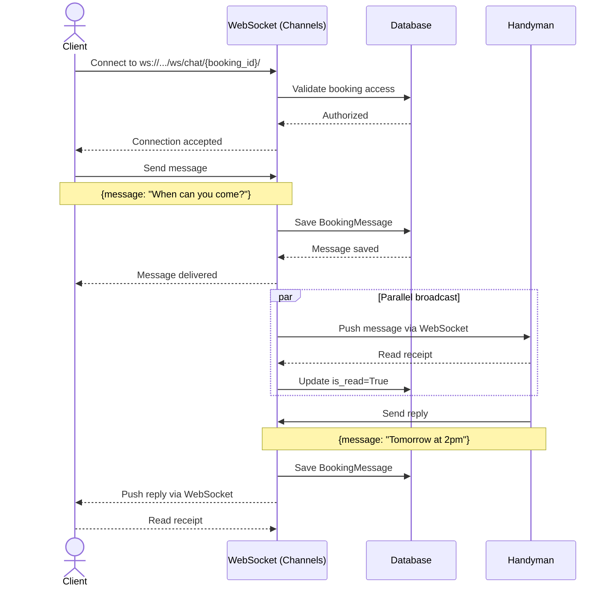
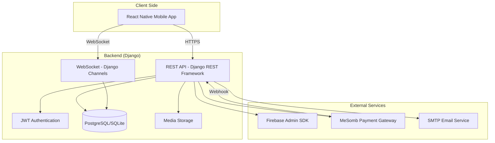

# HandymanRN — UML Diagrams v2

## 1. Class Diagrams by User Role

### 1.1 User (Client) Perspective



---

### 1.2 Handyman Perspective



---

### 1.3 Admin Perspective



---

## 2. Use Case Diagram — Booking & Payment System

```mermaid
usecaseDiagram
    actor "User (Client)" as client
    actor "Handyman" as handyman
    actor "Admin" as admin
    actor "MeSomb Payment" as mesomb

    rectangle "Authentication" {
        client --> (Register)
        client --> (Login)
        client --> (Reset Password via OTP)
        client --> (Enable 2FA)
        handyman --> (Register)
        handyman --> (Login)
        handyman --> (Reset Password via OTP)
        handyman --> (Upload ID Card)
    }

    rectangle "Service Discovery" {
        client --> (Browse Services)
        client --> (Search Handymen)
        client --> (View Handyman Profile)
        client --> (View Job Portfolio)
        client --> (Save to Favorites)
    }

    rectangle "Booking Management" {
        client --> (Create Booking)
        client --> (Modify Booking Price)
        client --> (Cancel Booking)
        client --> (Mark as Complete)
        handyman --> (Accept Booking)
        handyman --> (Decline Booking)
    }

    rectangle "Payment Processing" {
        client --> (Pay via MTN Money)
        client --> (Pay via Orange Money)
        mesomb --> (Collect Payment)
        mesomb --> (Process Payout)
        handyman --> (Receive Payment)
        admin --> (View Platform Revenue)
        admin --> (Process Admin Withdrawal)
    }

    rectangle "Rating & Reviews" {
        client --> (Rate Handyman 1-10)
        client --> (Write Review)
        handyman --> (View Ratings)
    }

    rectangle "Communication" {
        client --> (Send Booking Message)
        handyman --> (Send Booking Message)
        client --> (Contact Support)
        handyman --> (Contact Support)
        admin --> (Reply to Support)
    }

    rectangle "Notifications" {
        client --> (Receive Notifications)
        handyman --> (Receive Notifications)
        admin --> (Send Notifications)
    }

    rectangle "Handyman Profile" {
        handyman --> (Set Availability)
        handyman --> (Upload Job Pictures)
        handyman --> (Subscribe to Plan)
    }
```

---

## 3. Sequence Diagrams

### 3.1 Booking Creation & Acceptance Flow



### 3.2 Payment Collection & Payout Flow



### 3.3 Authentication & OTP Flow



### 3.4 Chat Messaging Flow (WebSocket)



---

## 4. Deployment Architecture Diagram



---

## How to Use These Diagrams

### In GitHub Markdown (auto-renders):
Just paste the code blocks above into any `.md` file. GitHub will render them automatically.

### In VS Code:
1. Install extension: **"Markdown Preview Mermaid Support"**
2. Open this file
3. Press `Ctrl+Shift+V` to preview

### In Your Thesis/Document:
1. Use the **draw.io** VS Code extension to recreate these diagrams visually
2. Or use **PlantUML** with the same syntax (Mermaid and PlantUML are very similar)
3. Export as PNG/SVG and embed in your Word/LaTeX document

### For Presentations:
- Copy the Mermaid code into https://mermaid.live/
- Export as SVG/PNG
- Insert into PowerPoint/Google Slides