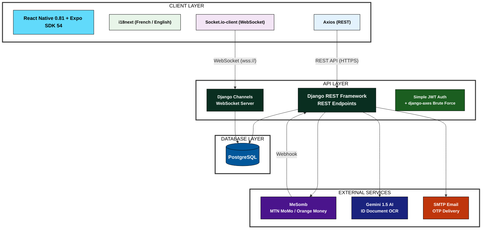

# HandymanWest — High-Level Architecture Diagram

> Only technologies actually implemented.  
> Excluded: Nginx, Gunicorn, Daphne, Redis, Firebase (not functional).

---



---

## Simplified Data Flow

```
┌─────────────────────────────────────────────────────────────┐
│                     MOBILE APP                              │
│  React Native + Expo (iOS & Android)                        │
│  ┌─────────────────────────────────────────────────────┐   │
│  │ Client Features:  │  Handyman Features:             │   │
│  │ • Sign Up / Login  │  • Sign Up / Profile Setup     │   │
│  │ • Browse Services  │  • ID Verification (OCR)       │   │
│  │ • Search Handymen  │  • Accept / Decline Bookings   │   │
│  │ • Book a Service   │  • Dashboard & Earnings        │   │
│  │ • Pay via MeSomb   │  • Chat with Clients           │   │
│  │ • Rate & Review    │  • Wallet & History            │   │
│  │ • Chat with HM     │                                 │   │
│  └─────────────────────────────────────────────────────┘   │
│       │                              │                      │
│       │ REST API (HTTPS)             │ WebSocket (wss://)   │
│       ▼                              ▼                      │
│    Axios ──────────────────►  Socket.io-client             │
└───────────────────────────┬─────────────────────────────────┘
                            │
                            │
┌───────────────────────────▼─────────────────────────────────┐
│                   DJANGO BACKEND                            │
│  ┌──────────────────┐    ┌───────────────────────────┐     │
│  │ Django REST      │    │ Django Channels           │     │
│  │ Framework (DRF)  │    │ • Real-time Chat          │     │
│  │ • All API Routes │    │ • Online Status           │     │
│  │ • Auth (JWT)     │    └───────────────────────────┘     │
│  │ • Business Logic │                                       │
│  │ • Validation     │    ┌───────────────────────────┐     │
│  │ • django-axes    │    │ Django Apps (9)           │     │
│  └──────────────────┘    │ users, services, locations │     │
│                          │ bookings, payments, chats  │     │
│                          │ ratings, favorites, notifs │     │
│                          └───────────────────────────┘     │
└───────────────────────┬─────────────────────────────────────┘
                        │
          ┌─────────────┼─────────────┐
          │             │             │
          ▼             ▼             ▼
┌──────────────┐ ┌──────────┐ ┌──────────────┐
│  PostgreSQL  │ │  Gemini  │ │   MeSomb     │
│  • All Data  │ │  AI API  │ │  Payment API │
│  • Users     │ │ • ID     │ │ • Collect    │
│  • Bookings  │ │   OCR    │ │ • Payout     │
│  • Payments  │ │ • Verify  │ │ • Webhook    │
│  • Messages  │ └──────────┘ └──────────────┘
│  • Ratings   │               ┌──────────────┐
│              │               │  SMTP Email  │
│              │               │  • OTP Codes │
│              │               │  • Notify    │
└──────────────┘               └──────────────┘
```

---

## Django Apps (9 total)

| App | Purpose |
|-----|---------|
| **users** | User & Handyman models, registration, login, OTP, PIN |
| **services** | Service categories (admin-managed) |
| **locations** | Geographic areas in West Region |
| **bookings** | Full lifecycle: pending → accepted → completed → paid |
| **payments** | MeSomb integration, wallets, commissions (70/30 split) |
| **chats** | Booking & support messaging |
| **ratings** | 1–10 reviews per user-handyman pair |
| **favorites** | Saved handymen |
| **notifications** | In-app alerts |

---

## Communication Summary

| From | To | Protocol | Purpose |
|------|----|----------|---------|
| Mobile App | Django REST Framework | HTTPS (REST) | All CRUD operations, auth, payments |
| Mobile App | Django Channels | WebSocket (wss) | Real-time chat, status updates |
| Django | PostgreSQL | TCP (SQL) | Data persistence |
| Django | MeSomb API | HTTPS | Collect mobile money, payout handymen |
| MeSomb | Django | Webhook | Transaction status callback |
| Django | Gemini AI API | HTTPS | ID document OCR & verification |
| Django | SMTP Email | SMTP | OTP codes, notifications |